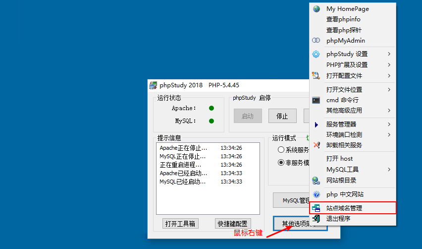
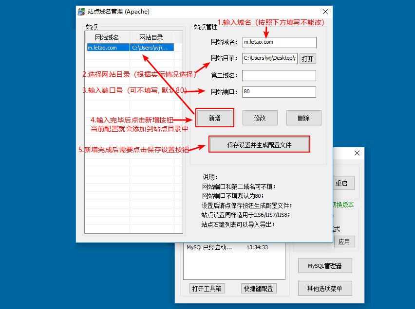

## 乐淘电商

### 项目简介

移动web电商购物网站 + PC端电商管理后台

#### 功能模块

##### 移动端

| 模块     | 功能                         |
| -------- | ---------------------------- |
| 首页     | 静态展示                     |
| 分类     | 一级分类、二级分类           |
| 商品     | 搜索中心、商品列表、商品详情 |
| 购物车   | 购物车管理                   |
| 用户     | 登录、注册、账户管理         |
| 收货地址 | 收货地址管理                 |

##### PC端

| 模块     | 功能                       |
| -------- | -------------------------- |
| 登录     | 管理员登录                 |
| 用户管理 | 用户权限管理               |
| 分类管理 | 一级分类、二级分类管理     |
| 商品管理 | 商品录入、删除、修改、展示 |

#### 开发模式

前后端开发分离，前端请求后端提供的**接口**处理业务逻辑，后端只负责**数据**的提供。


#### 项目架构

| 系统分层 | 使用技术                                              |
| -------- | ----------------------------------------------------- |
| 数据层   | MYSQL                                                 |
| 服务层   | NodeJs(express)                                       |
| 前端展示 | Promise、Axios(zepto)、art-template、Mui、fontAwesome |

### 项目搭建

当前项目支持跨域，采用的方式是CORS（Cross-Origin Resource Sharing, 跨源资源共享 ）。

#### 白名单

后端设置的跨域白名单如下：

| 网址            | 功能             |
| --------------- | ---------------- |
| [m.letao.com]() | 乐淘移动端购物   |
| www.letao.com   | 乐淘PC端网站管理 |

#### 搭建图示

1. 建立站点





2. 将域名添加到hosts文件中，以管理员权限打开下列文件

   文件路径 C:\Windows\System32\drivers\etc

   

#### 登录密码

| 前端         | 后端         |
| ------------ | ------------ |
| 账号：itcast | 账号：root   |
| 密码：111111 | 密码：123456 |

### Gulp构建工具

#### 官方网址

| 英文 | https://gulpjs.com        |
| ---- | ------------------------- |
| 中文 | http://www.gulpjs.com.cn/ |

#### 为什么要使用Gulp

提高开发效率 改善开发体验。

- 语法转换（es6、less ...）
- 文件保存，浏览器自动刷新
- 公共文件抽离再包含（类似php中的include）
- 项目上线，文件需要压缩合并
- 添加文件指纹防止浏览器缓存

#### Gulp是什么

- 前端自动化**流式**构建工具
- 编写机械化**任务**，即告诉它我们想要做什么，当需要做这件事情的时候，执行任务即可

#### Gulp依赖

gulp任务的执行依赖nodejs环境，所以在使用gulp之前需要安装node环境。

#### node安装失败解决方案

- 在安装程序出现2502、2503错误的解决方法
  - 以管理员身份运行cmd
  - 输入 msiexec /package node安装包位置
- 在命令行中输入node -v时 出现 node不是内部或外部命令，也不是可运行的程序或批处理文件
  - 将node.exe所在文件夹配置到环境变量中

#### Gulp使用

##### 初始化项目描述文件

- 在项目根目录下执行`npm init -y`命令
- 描述文件的作用
  - 记录当前项目信息、例如项目名称、版本、作者、github地址、当前项目依赖了哪些第三方库，目的是方便他人了解项目信息，下载项目文件。 

##### Gulp下载

- npm install gulp --save-dev
  - 在项目根目会自动生成node_modules文件夹 gulp会被下载到这个文件夹中.
  - node_modules文件夹中除gulp以外,还有其他文件，都是gulp所要依赖的文件。具体依赖了谁不需要开发人员关注.Gulp会自己管理。

##### 建立任务文件

在项目根目录下建立gulpfile.js文件，在此文件中书写Gulp任务代码。

##### 编写Gulp任务

在文件中引入Gulp，以达到获取Gulp Api的目的。

```javascript
// require('包名') 引包
var gulp = require('gulp');
// gulp变量是对象类型, 对象中有方法编写任务时需要用到
```

编写人生中的第一个gulp任务

```javascript
// gulp.task('任务名称', 函数) 创建任务
// 任务名称的用处:在执行任务的时候需要指定任务名称
// 函数:要做的事情需要写在回调函数中 比如less解析 代码压缩...
gulp.task('first',function(){
    // gulp.src('文件路径') 获取文件
    // 获取任务要处理的文件
    gulp.src('./css/base.css')
    // pipe('怎样处理') 处理任务
    // gulp.dest('文件路径') 将处理好的文件放入参数路径中
        .pipe(gulp.dest('dist/css'))
});
```

##### 执行Gulp任务

- 任务被写在gulpfile.js文件中，过去运行JS是将文件引入到HTML文件中，运行HTML文件JS就会被执行，问题是现在并没有HTML文件。
- 那么如何直接运行gulpfile.js文件呢? 非常简单! 只要安装一个gulp-cli工具即可
- 在命令行工具中运行命令`npm install gulp-cli -g`
  - -g 代表全局安装 目的是在其他项目中也可以使用这个工具
- 执行Gulp任务
  - 在项目根目录中运行命令 `gulp 任务名称`
  - 命令会在当前目录下自动查找gulpfile.js文件，执行文件中对应的任务

##### Gulp中提供的方法

- gulp.src() 获取任务要处理的文件
- gulp.dest() 输出文件
- gulp.task() 建立gulp任务
- gulp.watch() 监控文件的变化

Gulp本身提供的方法并不多，大多数任务都是由插件完成的。

##### Gulp插件地址

- [gulp-htmlmin](https://www.npmjs.com/package/gulp-htmlmin) html文件压缩
- [gulp-less](https://www.npmjs.com/package/gulp-less) 将less转换为css
- [gulp-csso](https://www.npmjs.com/package/gulp-csso) 压缩css
- [gulp-autoprefixer](https://www.npmjs.com/package/gulp-autoprefixer) 自动添加css前缀
- [gulp-babel](https://www.npmjs.com/package/gulp-babel) 将新的JavaScript语法转化浏览器能够认识的语法
- [browser-sync](http://www.browsersync.cn/docs/gulp/) 浏览器实时同步工具
- [gulp-clean](https://github.com/peter-vilja/gulp-clean) 清除文件
- [run-sequence](https://github.com/OverZealous/run-sequence) 使任务按顺序执行
- [gulp-rev](https://www.npmjs.com/package/gulp-rev) 生成文件指纹
- [gulp-rev-collector](https://www.npmjs.com/package/gulp-rev-collector) 替换文件指纹
- [gulp-rename](https://www.npmjs.com/package/gulp-rename) 更改文件名称
- [gulp-file-include](https://www.npmjs.com/package/gulp-file-include) 文件拆分

